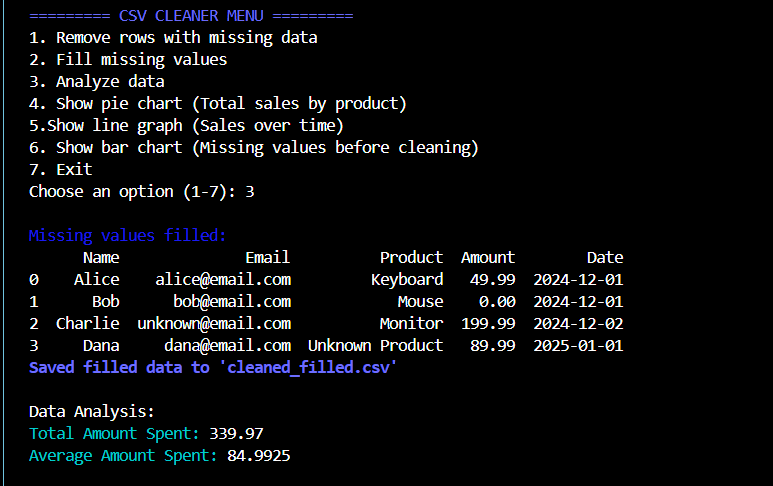
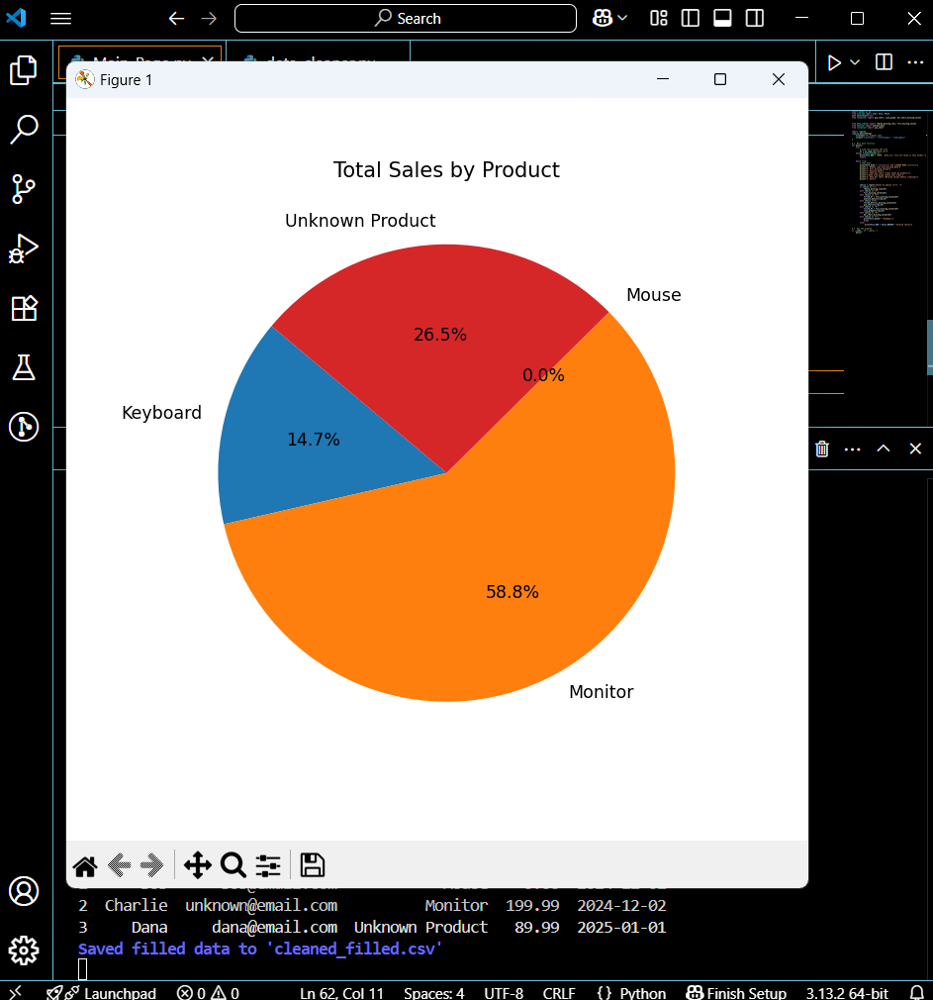
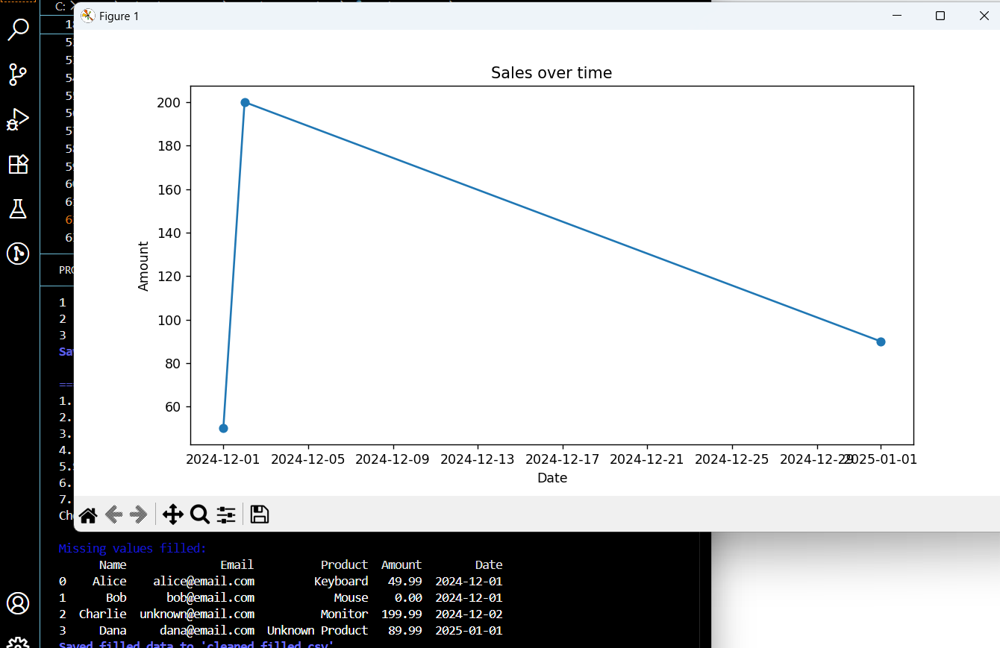
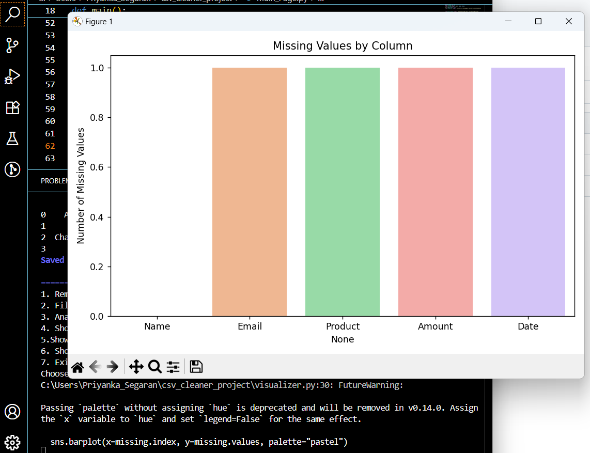

# CSV-Cleaner-Project
A Python tool to clean, analyze, and visualize CSV data.
Perfect for learning how to work with pandas, matplotlib, and command-line tools.

## Features
- Load and preview CSV files
- Remove rows with missing data
- Fill missing values (e.g. with 0 or null)
- Analyze total and average sales and product breakdown
- Create pie and line charts using matplotlib
- Colorful, menu-driven interface in the terminal

## Libraries used 
- pandas	- To load, clean, and analyze data in your CSV file
- matplotlib.pyplot	- To draw charts (pie, line graphs, etc.)
- seaborn	- To create attractive bar charts more easily
- colorama	- To add color to terminal text (user menu, messages)

## Files
- csv_cleaner_project/
│
├── Main_Page.py # Main menu and controller
├── data_cleaner.py # Cleans data (removes/fills missing values)
├── analyzer.py # Data analysis (e.g., total/ average sales)
├── visualizer.py # Charts (pie, line, bar graph)
├── data.csv # Sample input CSV file
└── README.md # Project description (this file)

## Real-World Features 
- Feature	Real-World Purpose
- Reads from data.csv	Simulates importing business data
- Cleans data (drop or fill)	Mimics a real data-preparation task
- Saves new cleaned CSVs	Allows sharing or further use
- Produces data analysis	Mimics business intelligence reports
- Shows charts	Helps visualize data for stakeholders or team leads
- Error handling (file not found)	Prevents crashes; makes your tool reliable

##Screenshots
**Main Menu:**

**Pie Chart Example:**

**Line Graph Example:**

**BAR Graph Example:**

